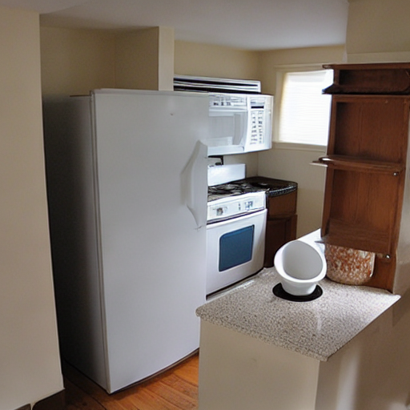
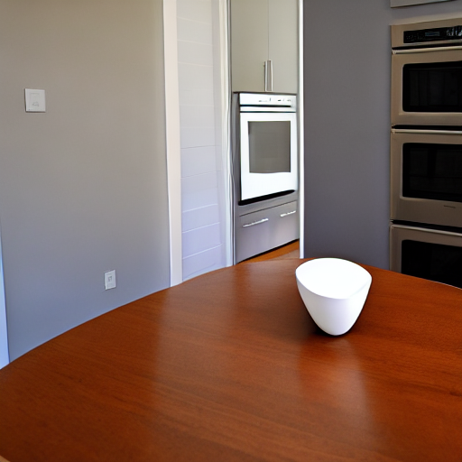
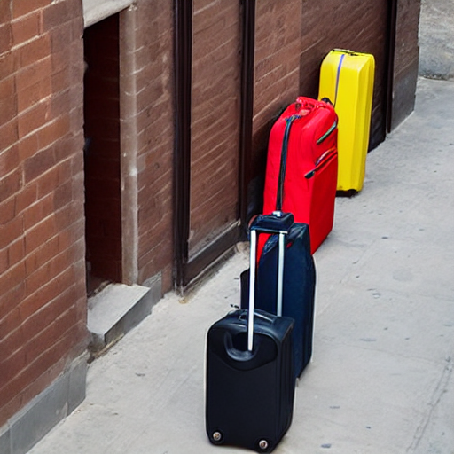
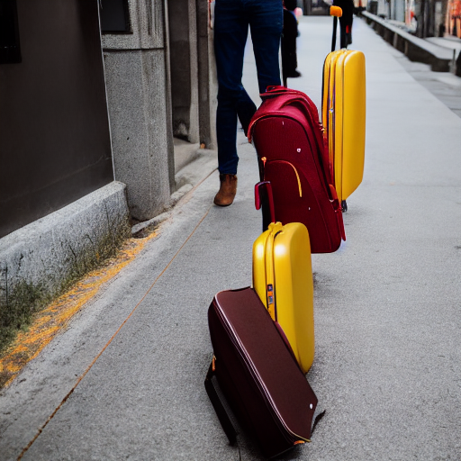
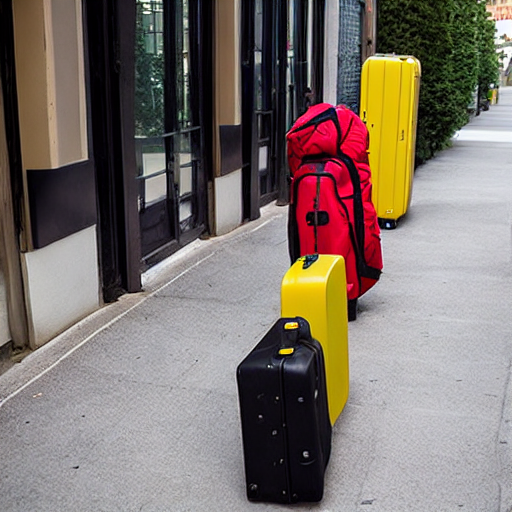

# Seed, Trajectory, and Auxiliary-Model Robustness

## Protocol

We evaluate the original MIGC and InteractDiffusion configurations on 10 fixed MIG-Bench prompts spanning 2–6 instances (two prompts per complexity level). Each prompt is generated with five paired random seeds: 42, 123, 3407, 2026, and 10007.

All methods use 50 inference steps. AMDM aggregates MIGC and InteractDiffusion during the first 20 steps, with aggregation weight $\omega=0.5$ and optimization coefficient $\eta=0.3$. The same prompt and seed are used for every paired comparison.

## Quantitative Results

The table reports the mean and sample standard deviation across the five seed-level summaries (%).

| Method | Image Success | Instance Success | Localization | mIoU |
|---|---:|---:|---:|---:|
| InteractDiffusion | 8.00 ± 4.47 | 33.00 ± 3.71 | 77.00 ± 3.26 | 64.41 ± 3.60 |
| MIGC | 6.00 ± 5.48 | 50.50 ± 8.18 | 78.00 ± 4.47 | 66.11 ± 2.88 |
| InteractDiffusion (+MIGC) | **14.00 ± 5.48** | **48.00 ± 7.16** | **82.50 ± 5.00** | **71.07 ± 3.49** |

AMDM improves InteractDiffusion's instance success rate for all five seeds, with a paired gain of **15.00 ± 5.30 percentage points**. Across the 50 paired prompt–seed cases, AMDM produces 25 improvements, 23 ties, and 2 degradations.

Under a strict auxiliary-failure definition—MIGC does not satisfy every requested instance—47 cases remain. Among them, AMDM produces 23 improvements, 22 ties, and 2 degradations, with an average instance-success gain of 15.99 percentage points and an average mIoU gain of 5.39 percentage points. These results suggest that the gain is not tied to one random trajectory and that the method has some tolerance to partial auxiliary-model failure. They do not imply explicit failure detection or reliability estimation.

The machine-readable summary is provided in [`results/robustness.json`](../results/robustness.json).

## Qualitative Examples

### Case 1: auxiliary model succeeds

Prompt: *a photo of a white oven and a white bowl* (seed 42).

| InteractDiffusion | MIGC | InteractDiffusion (+MIGC) |
|---|---|---|
|  |  |  |
| Instance success: 50%; mIoU: 38.30% | Instance success: 100%; mIoU: 80.76% | Instance success: 100%; mIoU: 85.07% |

### Case 2: auxiliary model only partially succeeds

Prompt: *a photo of a red backpack and a brown suitcase and a yellow suitcase and a yellow suitcase* (seed 123).

| InteractDiffusion | MIGC | InteractDiffusion (+MIGC) |
|---|---|---|
|  |  |  |
| Instance success: 25%; mIoU: 58.29% | Instance success: 25%; mIoU: 75.35% | Instance success: 75%; mIoU: 84.44% |
